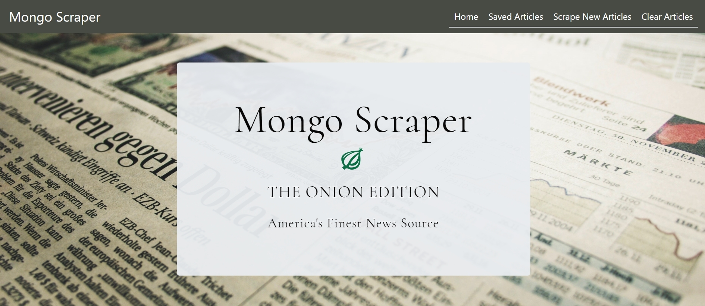
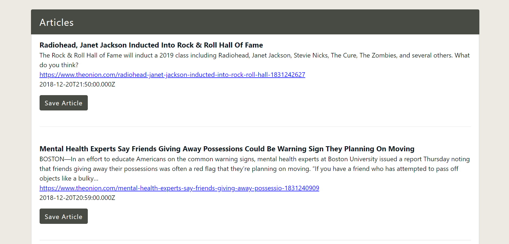
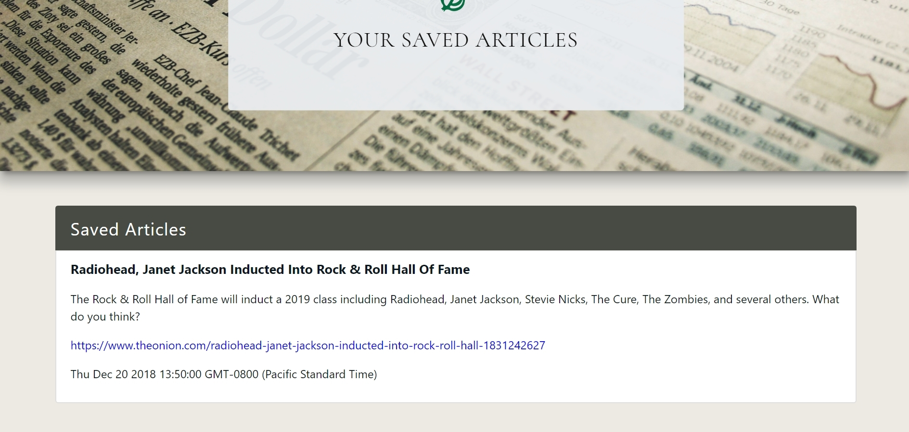
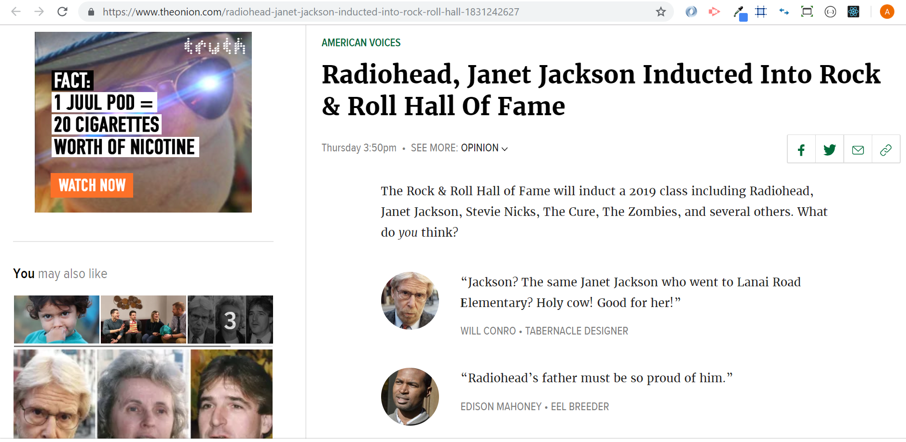

# Mongo-Scraper: The Onion Edition

# Project Description

Mongo-Scraper: The Onion Edition is a full-stack application that follows the MVC design pattern. It is an app that scrapes articles from *The Onion* (https://www.theonion.com/) and saves them in a database. Users can then save articles of their choice. Clicking on the "Save Article" button directs users to the Saved Article page, where a list of saved articles is displayed. Users can also delete saved articles, or add written notes to their articles. There is also a button to clear all of the articles on the page.

Mongo-Scraper uses Express, Node, MongoDB, Handlebars, jQuery, and JavaScript. NPM packages used are Express, Express-Handlebars, Mongoose, Cheerio, Axis, and Morgan. Bootstrap is used on the front-end for the design. The fonts used ('Cormorant' and 'Open Sans') come from Google Fonts. The background image comes from https://www.pexels.com/.

# Technologies Used

* Express.js
* Node.js
* NPM packages: Express, Express-Handlebars, Mongoose, Cheerio, Axis, Morgan
* MongoDB
* Handlebars
* AJAX/APIs
* jQuery
* JavaScript
* Bootstrap
* CSS
* HTML

# "Mongo-Scraper: The Onion Edition" Live Link

"Mongo-Scraper: The Onion Edition" is deployed to Heroku. Please check it out here:

https://salty-springs-46730.herokuapp.com/

# Screenshots

